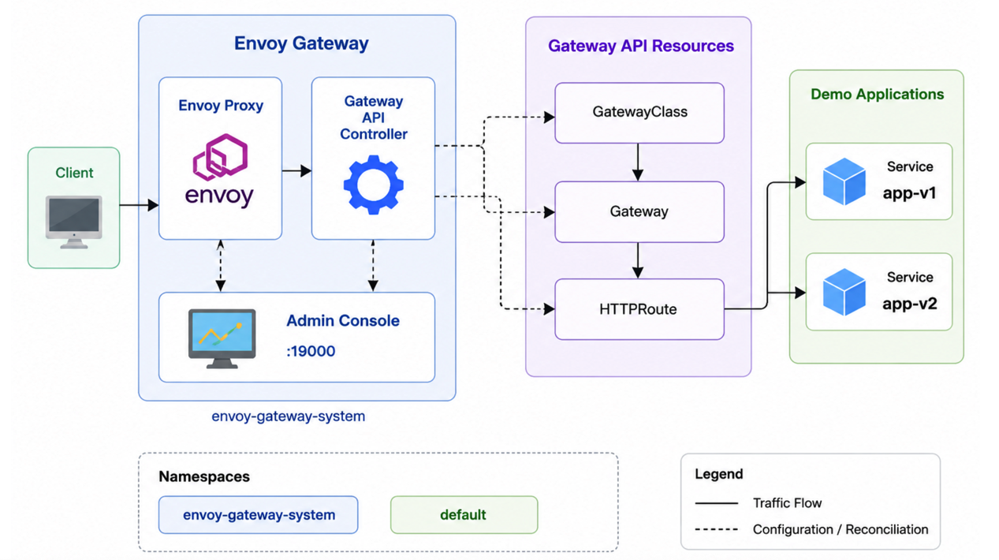

<p align="center">
  
</p>

<h1 align="center">Envoy Gateway Playground</h1>

<p align="center">
An Open Source Proof of Concept demonstrating Kubernetes Gateway API routing with Envoy Gateway.
</p>

<p align="center">


</p>

---

# 🎯 Overview

**Envoy Gateway PoC** is an educational Proof of Concept developed by **OpenMind Systems Lab**.

This project demonstrates how to deploy and use **Envoy Gateway** with the **Kubernetes Gateway API** in a local Kubernetes environment.

The PoC installs Envoy Gateway, deploys two demo HTTP applications, creates a `GatewayClass`, configures a `Gateway` and an `HTTPRoute`, then validates path-based routing through Envoy Proxy.

This repository is designed to be simple, reproducible and easy to understand.

---

# 🚀 Learning Objectives

After completing this Proof of Concept you will understand how to:

- Install Envoy Gateway on Kubernetes
- Use the Kubernetes Gateway API
- Create a `GatewayClass`
- Deploy a `Gateway` resource
- Configure an `HTTPRoute`
- Route traffic to multiple backend services
- Test local routing with `kubectl port-forward`
- Understand the role of Envoy Proxy as a Kubernetes gateway

---

# 🏗 Architecture



Request flow:

```text
Client
  │
  ▼
Envoy Proxy
  │
  ▼
Gateway API HTTPRoute
  │
  ├── /v1 ──► app-v1 Service ──► app-v1 Pod
  │
  └── /v2 ──► app-v2 Service ──► app-v2 Pod
```

---

# 🎯 Objective

The objective of this PoC is to expose two demo applications through **Envoy Gateway** using path-based routing.

| Path | Backend service | Expected response |
|------|-----------------|-------------------|
| `/v1` | `app-v1` | `hello from app v1` |
| `/v2` | `app-v2` | `hello from app v2` |

---

# 📁 Repository Structure

```text
.
├── manifests/
│   ├── 00-namespace.yaml
│   ├── 01-demo-apps.yaml
│   ├── 02-gatewayclass.yaml
│   └── 03-gateway.yaml
├── media/
│   └── schema.png
├── README.md
└── LICENSE
```

---

# 📋 Prerequisites

- Kubernetes cluster
- `kubectl`
- Internet access to pull Envoy Gateway manifests and container images

Example local environments:

- Docker Desktop Kubernetes
- kind
- minikube

Check your cluster:

```bash
kubectl cluster-info
kubectl get nodes
```

---

# ⚙️ Install Envoy Gateway

Install Envoy Gateway:

```bash
kubectl apply --server-side \
  -f https://github.com/envoyproxy/gateway/releases/download/v1.8.1/install.yaml
```

Wait for the Envoy Gateway controller:

```bash
kubectl wait --timeout=5m \
  -n envoy-gateway-system deployment/envoy-gateway \
  --for=condition=Available
```

Verify the installation:

```bash
kubectl get pods -n envoy-gateway-system
```

Expected result:

```text
NAME                             READY   STATUS
envoy-gateway-xxxxxxxxxx-xxxxx   1/1     Running
```

---

# 📦 Deploy the Demo Applications

Apply the demo applications:

```bash
kubectl apply -f manifests/01-demo-apps.yaml
```

Verify:

```bash
kubectl get pods
kubectl get svc
```

Expected resources:

```text
app-v1
app-v2
```

---

# 🌐 Deploy Gateway API Resources

Create the `GatewayClass` used by the PoC:

```bash
kubectl apply -f manifests/02-gatewayclass.yaml
```

Apply the `Gateway` and `HTTPRoute` resources:

```bash
kubectl apply -f manifests/03-gateway.yaml
```

Verify:

```bash
kubectl get gatewayclass
kubectl get gateway
kubectl get httproute
```

Expected resources:

```text
GatewayClass: eg
Gateway:      eg-poc
HTTPRoute:    eg-poc-route
```

---

# 🔎 Validate Resources

Wait for the `Gateway` to be accepted and programmed:

```bash
kubectl wait --for=condition=Accepted gateway/eg-poc --timeout=60s
kubectl wait --for=condition=Programmed gateway/eg-poc --timeout=180s
```

Check all PoC resources:

```bash
kubectl get gatewayclass
kubectl get gateway eg-poc
kubectl get httproute eg-poc-route
kubectl get pods
kubectl get svc
kubectl get pods,svc -n envoy-gateway-system
```

You should see:

- Envoy Gateway running in `envoy-gateway-system`
- One generated Envoy data-plane Pod running in `envoy-gateway-system`
- Two demo applications running in the default namespace
- A `GatewayClass` named `eg`
- A `Gateway` named `eg-poc`
- An `HTTPRoute` named `eg-poc-route`

---

# 🧪 Test the Routing

Envoy Gateway creates an Envoy Proxy service for the `Gateway`.

Retrieve the generated Envoy service name:

```bash
ENVOY_SERVICE=$(kubectl get svc -n envoy-gateway-system \
  -o name | grep envoy-default-eg-poc | head -n 1)

echo $ENVOY_SERVICE
```

Port-forward the Envoy service locally:

```bash
kubectl -n envoy-gateway-system port-forward $ENVOY_SERVICE 8888:80
```

In another terminal, test the `/v1` route:

```bash
curl http://localhost:8888/v1
```

Expected result:

```text
hello from app v1
```

Test the `/v2` route:

```bash
curl http://localhost:8888/v2
```

Expected result:

```text
hello from app v2
```

---

# 🖥️ Envoy Gateway Admin Console

Envoy Gateway exposes an admin interface that can be used for local inspection and troubleshooting.

Port-forward the Envoy Gateway deployment:

```bash
kubectl -n envoy-gateway-system port-forward deployment/envoy-gateway 19000:19000
```

Open:

```text
http://localhost:19000
```

---

# 🔍 Expected Result

Once the PoC is deployed:

- Envoy Gateway is installed successfully.
- The `GatewayClass` is accepted by Envoy Gateway.
- The `Gateway` is accepted and programmed.
- Envoy Proxy routes `/v1` traffic to `app-v1`.
- Envoy Proxy routes `/v2` traffic to `app-v2`.
- Local traffic is accessible through `http://localhost:8888`.

---

# 🛠 Troubleshooting

If the `Gateway` stays in `Programmed=False`, inspect it:

```bash
kubectl describe gateway eg-poc
```

If you see `Waiting for controller`, verify the `GatewayClass`:

```bash
kubectl get gatewayclass
kubectl describe gatewayclass eg
```

If you see `Envoy replicas unavailable`, check the generated Envoy data-plane Pod:

```bash
kubectl get pods -A | grep -i envoy
kubectl get events -A --sort-by=.lastTimestamp | tail -30
```

If the route does not answer, verify the `HTTPRoute`:

```bash
kubectl describe httproute eg-poc-route
```

---

# 📚 What You Will Learn

This Proof of Concept introduces several important Kubernetes and platform engineering concepts:

- Gateway API fundamentals
- Envoy Gateway architecture
- GatewayClass and controller binding
- Path-based HTTP routing
- Kubernetes services and deployments
- Local traffic testing with port-forwarding
- Cloud Native ingress patterns

---

# 🔬 Research Context

This repository is part of the **OpenMind Systems Lab** research program focused on:

- ☸️ Cloud Native
- 🔒 Infrastructure Security
- 📨 Distributed Messaging
- ⚙️ Platform Engineering
- 📊 Technical Benchmarking
- 🤖 Artificial Intelligence & MCP

Discover all projects:

```text
https://github.com/openmind-systems-lab
```

---

# 🧹 Cleanup

Delete the Gateway API resources:

```bash
kubectl delete -f manifests/03-gateway.yaml --ignore-not-found=true
kubectl delete -f manifests/02-gatewayclass.yaml --ignore-not-found=true
```

Delete the demo applications:

```bash
kubectl delete -f manifests/01-demo-apps.yaml --ignore-not-found=true
```

Uninstall Envoy Gateway:

```bash
kubectl delete -f https://github.com/envoyproxy/gateway/releases/download/v1.8.1/install.yaml \
  --ignore-not-found=true
```

---

# 📚 References

- https://gateway.envoyproxy.io
- https://gateway-api.sigs.k8s.io
- https://www.envoyproxy.io

---

# 🤝 Contributing

Contributions, ideas and improvements are welcome.

Feel free to:

- Open an Issue
- Submit a Pull Request
- Suggest improvements
- Share feedback

---

# 📄 License

This project is released under the MIT License.

---

# 🏛 About OpenMind Systems Lab

OpenMind Systems Lab is an independent French non-profit association dedicated to research, experimental development and technical benchmarking in Cloud Native technologies.

Our mission is to produce practical, reproducible and educational Open Source Proofs of Concept covering Kubernetes, Platform Engineering, Distributed Messaging, Infrastructure Security and Artificial Intelligence.

GitHub Organization:

https://github.com/openmind-systems-lab

---

<p align="center">
Made with ❤️ by OpenMind Systems Lab
</p>
